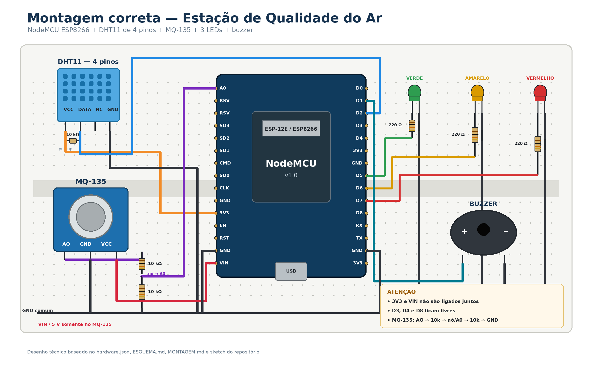

# Esquema de ligação

Representação visual da montagem descrita em [hardware.json](hardware.json).
Para o passo a passo e os testes, veja [MONTAGEM.md](MONTAGEM.md).



> **Como ler este desenho.** É um esquemático, não um layout de protoboard: o fundo
> pontilhado é decorativo e não representa os furos nem os trilhos de alimentação. Ele mostra
> *o que liga em quê*, não *em qual furo espetar*. Para a montagem física use a tabela de
> pinos abaixo e o [MONTAGEM.md](MONTAGEM.md).
>
> **Em caso de divergência, a tabela de pinos manda.** Dois pontos do desenho merecem
> conferência: o fio verde do LED verde termina no **D5** (o trecho horizontal dele passa na
> altura do D4), e os cátodos dos três LEDs mais o negativo do buzzer precisam chegar de fato
> à linha de GND comum.

---

## Diagrama geral

```
                         ┌───────────────────────────┐
                         │      NodeMCU ESP8266      │
                         │           Amica           │
                         │                           │
     DHT11               │                           │
   ┌────────┐            │                           │
   │  VCC ──┼────────────┤ 3V3                       │
   │  DATA ─┼────────────┤ D2  (GPIO4)               │
   │  GND ──┼────────────┤ GND                       │
   └────────┘            │                           │
                         │                        D5 ├──[220Ω]──▶|── GND   LED verde
    MQ-135               │                        D6 ├──[220Ω]──▶|── GND   LED amarelo
   ┌────────┐            │                        D7 ├──[220Ω]──▶|── GND   LED vermelho
   │  VCC ──┼────────────┤ Vin (5V)                  │
   │  GND ──┼────────────┤ GND                       │
   │   AO ──┼───┐        │                        D1 ├────────┐
   └────────┘   │        │                           │        │
                │        │ A0                        │      ┌─┴──┐
             [10kΩ]      └──────────┬────────────────┘      │ ♪  │  Buzzer
                │                   │                       └─┬──┘
                ├───────────────────┘                         │
                │                                            GND
             [10kΩ]
                │
               GND
```

O nó entre os dois resistores de 10 kΩ é o que vai para o A0. Esse divisor corta
a tensão pela metade: os 5 V máximos do MQ-135 viram 2,5 V, dentro do que o A0
aceita.

---

## Divisor de tensão do MQ-135, em detalhe

É a única parte da montagem que não é ligação direta, e a que mais gera erro.

```
   MQ-135
   ┌──────┐
   │  AO  ├────┬─────────────────── (nada mais aqui)
   └──────┘    │
             [10kΩ]   ← resistor de cima
               │
               ├──────────────────▶ A0 do NodeMCU
               │
             [10kΩ]   ← resistor de baixo
               │
              GND
```

**Como conferir se está certo:** com o circuito ligado, meça com um multímetro entre
o nó do meio e o GND. O valor deve ser cerca de metade do que você mede entre o AO
do MQ-135 e o GND. Se os dois forem iguais, um dos resistores não está fazendo
contato.

10 kΩ = marrom, preto, laranja, dourado.

---

## Mapa de pinos

| Pino NodeMCU | GPIO | Ligado a | Direção |
|---|---|---|---|
| `3V3` | — | DHT11 VCC | alimentação |
| `Vin` | — | MQ-135 VCC | alimentação 5 V |
| `GND` | — | trilho comum | terra |
| `D1` | 5 | Buzzer (+) | saída |
| `D2` | 4 | DHT11 DATA | bidirecional |
| `D5` | 14 | LED verde (via 220 Ω) | saída |
| `D6` | 12 | LED amarelo (via 220 Ω) | saída |
| `D7` | 13 | LED vermelho (via 220 Ω) | saída |
| `A0` | — | saída do divisor | entrada analógica |

### Pinos deixados livres de propósito

| Pino | GPIO | Motivo |
|---|---|---|
| `D3` | 0 | Strapping pin — se estiver em LOW no boot, a placa entra em modo de gravação |
| `D4` | 2 | Strapping pin — precisa estar em HIGH no boot |
| `D8` | 15 | Pull-down interno — carga nele impede o boot |

---

## Orientação dos componentes

**LED** — a perna longa é o ânodo (+), vai para o resistor. A perna curta é o cátodo (−),
vai para o GND. Pelo corpo: o lado com o chanfro reto é o cátodo.

```
        ânodo (+)          cátodo (−)
        perna longa        perna curta
            │                  │
            └──┐            ┌──┘
             ┌─┴────────────┴─┐
             │   ╭─────╮      │ ← chanfro reto deste lado
             │   ╰─────╯      │
             └────────────────┘
```

**DHT11 de 4 pinos** — com a grade virada para você:

```
   ┌─────────────┐
   │ ▓▓▓▓▓▓▓▓▓▓▓ │   grade virada para você
   │ ▓▓▓▓▓▓▓▓▓▓▓ │
   └─┬───┬───┬─┬─┘
     │   │   │ │
    VCC DATA NC GND
```

Precisa de 10 kΩ entre VCC e DATA.

**DHT11 de 3 pinos (com PCB)** — o pull-up já está embutido, mas a ordem dos pinos varia
por fabricante. **Leia a serigrafia da placa**, não presuma.

---

## Fluxo do programa

```
   ┌──────────────┐
   │  ler DHT11   │──▶ temperatura, umidade
   └──────┬───────┘
          │
   ┌──────▼───────┐
   │  ler A0      │──▶ gas (0..1023)
   └──────┬───────┘
          │
   ┌──────▼────────────────────────────────┐
   │  gas < LIMITE_MODERADO ?              │──sim──▶ BOM       LED verde
   └──────┬────────────────────────────────┘
          │ não
   ┌──────▼────────────────────────────────┐
   │  gas < LIMITE_RUIM ?                  │──sim──▶ MODERADO  LED amarelo
   └──────┬────────────────────────────────┘
          │ não
   ┌──────▼────────────┐
   │  RUIM             │──▶ LED vermelho + buzzer
   └───────────────────┘
```
